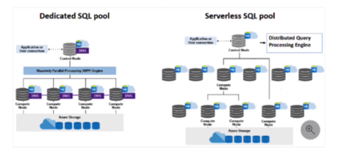
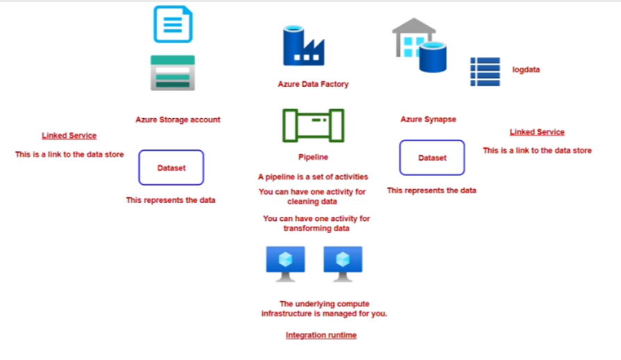

# Data-Engineering-2024

## Azure Data Synapse Analytics
Azure Synapse Analytics is an enterprise analytic service that accelerates time to insight across big data and data warehouse systems.
It brings together the best of SQL technologies used in enterprise data warehousing. Apache Spark technologies for big data and Azure Data
Explorer for log and time series analytics

## Azure Synapse Architecture

## Azure Data Factory

It is basically an integration service where you can perform ETL (Extract Transform Load) or ELT (Extract Load Transform)

